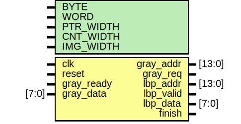
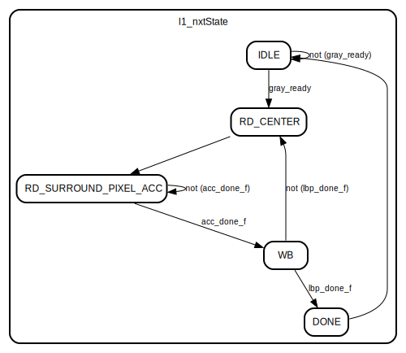

# Entity: LBP

- **File**: LBP.v
## Diagram

## Generics

| Generic name | Type | Value | Description |
| ------------ | ---- | ----- | ----------- |
| BYTE         |      | 8     |             |
| WORD         |      | 8     |             |
| PTR_WIDTH    |      | BYTE  |             |
| CNT_WIDTH    |      | BYTE  |             |
| IMG_WIDTH    |      | 128   |             |
## Ports

| Port name  | Direction | Type   | Description |
| ---------- | --------- | ------ | ----------- |
| clk        | input     |        |             |
| reset      | input     |        |             |
| gray_addr  | output    | [13:0] |             |
| gray_req   | output    |        |             |
| gray_ready | input     |        |             |
| gray_data  | input     | [7:0]  |             |
| lbp_addr   | output    | [13:0] |             |
| lbp_valid  | output    |        |             |
| lbp_data   | output    | [7:0]  |             |
| finish     | output    |        |             |
## Signals

| Name                        | Type                 | Description |
| --------------------------- | -------------------- | ----------- |
| l1_curState                 | reg [7:0]            |             |
| l1_nxtState                 | reg [7:0]            |             |
| state_IDLE                  | wire                 |             |
| state_RD_CENTER             | wire                 |             |
| state_RD_SURROUND_PIXEL_ACC | wire                 |             |
| state_WB                    | wire                 |             |
| state_DONE                  | wire                 |             |
| row_ptr                     | reg  [PTR_WIDTH-1:0] |             |
| col_ptr                     | reg  [PTR_WIDTH-1:0] |             |
| offset_row                  | reg  [PTR_WIDTH-1:0] |             |
| offset_col                  | reg  [PTR_WIDTH-1:0] |             |
| offset_cnt                  | reg  [PTR_WIDTH-1:0] |             |
| surrounding_pixel_value     | reg  [     WORD-1:0] |             |
| acc_ff                      | reg  [     WORD-1:0] |             |
| center_pixel_ff             | reg  [     WORD-1:0] |             |
| surrounding_pixel_ff        | reg  [     WORD-1:0] |             |
| result_buf                  | reg  [     WORD-1:0] |             |
| imgRightBoundReach_f        | wire                 |             |
| imgBottomBoundReach_f       | wire                 |             |
| acc_done_f                  | wire                 |             |
| lbp_done_f                  | wire                 |             |
## Constants

| Name                  | Type | Value     | Description |
| --------------------- | ---- | --------- | ----------- |
| IDLE                  |      | 6'b000001 |             |
| RD_CENTER             |      | 6'b000010 |             |
| RD_SURROUND_PIXEL_ACC |      | 6'b001000 |             |
| WB                    |      | 6'b010000 |             |
| DONE                  |      | 6'b100000 |             |
## Processes
- unnamed: ( @(posedge clk or posedge reset) )
  - **Type:** always
  - **Description**

- unnamed: ( @(*) )
  - **Type:** always
- FINISH: ( @(*) )
  - **Type:** always
- LBP_MEM_CTR: ( @(posedge clk or posedge reset) )
  - **Type:** always
- GRAY_MEM_CTR: ( @(*) )
  - **Type:** always
- OFFFSET_CNT: ( @(posedge clk or posedge reset) )
  - **Type:** always
- PTRS: ( @(posedge clk or posedge reset) )
  - **Type:** always
- DET_PIXEL_VALUE: ( @(*) )
  - **Type:** always
- RD_GRAY_DATA: ( @(posedge clk or posedge reset) )
  - **Type:** always
- ACCUMULATION: ( @(posedge clk or posedge reset) )
  - **Type:** always
## State machines

